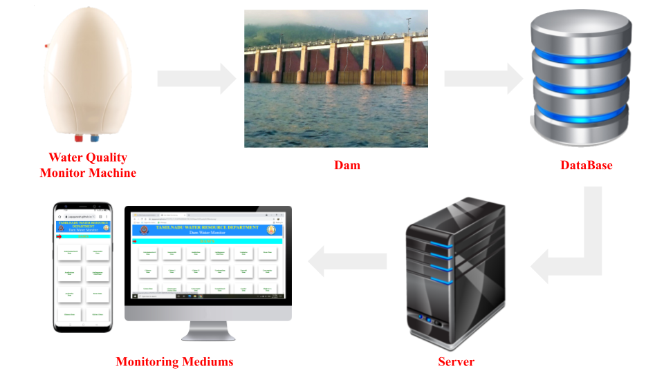
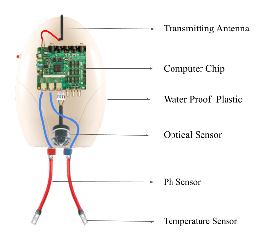

# WATER QUALITY MONITOR
Dams play a crucial role in water supply. Water resources plays important roles in Creature of world. Dam is used to regulate the flow of water in rivers and to provide adequate amounts of quality freshwater to necessary things. There is a need to monitor water quality and resources by checking the water level of dams and quality of water. We have developed a unique monitoring tool based on the IOT known as <b>Water Quality Monitor.</b> This tool help us to monitor level, flow of Dam and to check quality of water by the common people. And this tool also alert if there is critical condition in dams to common peoples, workers of dams and higher authority of goverment.
## Implementation

### Tools
<h3 style="font-size: 50px;">&raquo;  Hardware</h3>
<ul>
  <li><b>Ph Sensor</b> - Calculate Ph of water</li>
  <li><b>Temperature Sensor</b> - Calculate Temperature of water</li>
  <li><b>Optical Sensors</b> - Calculate Flow and Level of Dam</li>
  <li><b>Computer Chip</b> - Collects all data and send to transmiter</li>
  <li><b>Transmitter</b> - Sends the data to the Database</li>
</ul>

<h3 style="font-size: 50px;">&raquo;  Software</h3>
<ul>
  <li><b>Notepad</b> - Designing and Creating Webpages</li>
  <li><b>Github</b> - Hosting the Webpages</li>
  <li><b>Firebase</b> - Real Time Database</li>
</ul>

### Hardware Architechture

## Prototype
https://jagaganesh.github.io/TCE/TCE_IT_FOURT%20SEMESTER_PM/Water%20Quality%20Monitoring/

### Stimulation
https://www.tinkercad.com/things/9E8cdLTm3De-water-quality-monitor/editel?sharecode=REdZF-S6RcKmIQKf4jpxHuw-JBuGyy1rG2l0ghVlF9c
 
## About Us
This project was done by <b>JagaGanesh D</b>, <b>Lokkeswaran S</b> and <b>Velmurugan M</b>. We are students of IT Department from Thiagarajar College of Engineering, Madurai. This project inspired by Project Management the course belongs to Second Year Fourt Semester of IT department (January 2021 - May 2021).
